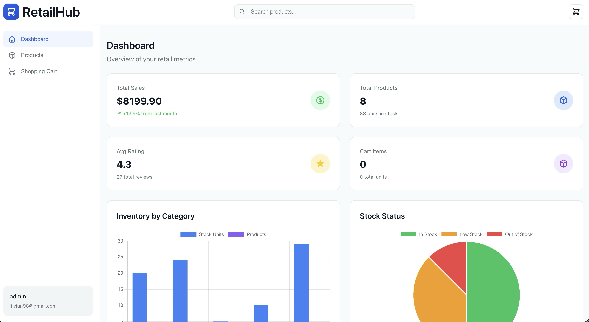
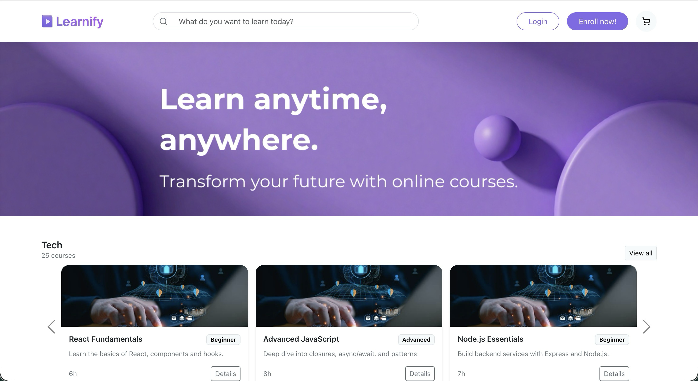
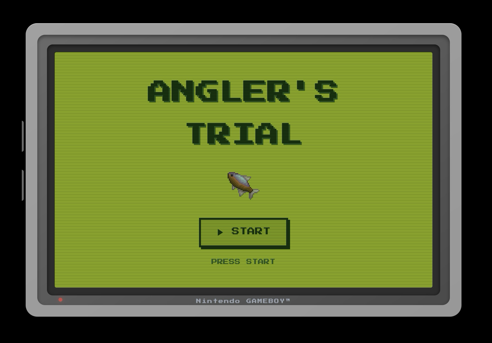

# Eunsuh Jeon — Web Developer Portfolio

A responsive, single-page portfolio built with React and Vite. It presents my background, skills, featured projects, resume, and contact information in a layout suitable for employers and clients.

## Live Site

**https://eunsuhjeon.netlify.app**

## Screenshots

### Profile


### Featured Projects

| Retail Dashboard | Learnify CourseHub | Angler's Trial |
| --- | --- | --- |
|  |  |  |

## Features

- **Hero** — Profile photo, role, summary, and links to GitHub / LinkedIn
- **About** — Professional background and career goals
- **Skills** — Frontend, backend, and tools grouped by category
- **Projects** — Three featured projects with descriptions, tech tags, GitHub links, and live demos
- **Resume** — Downloadable PDF (`public/resume.pdf`)
- **Contact** — Email, social links, and a form that opens the visitor's email client via `mailto:`

## Tech Stack

- **React** 18
- **Vite** 6
- **Tailwind CSS** 4
- **Radix UI** + custom UI components
- **Lucide React** (icons)
- **Inter** (Google Fonts)

## Featured Projects

| Project | Description | Code | Live Demo |
| --- | --- | --- | --- |
| Retail Dashboard App | Full-stack retail dashboard with cart, checkout, and analytics | [GitHub](https://github.com/EunsuhJeon/retail-dashboard-app) | [Live](https://retail-es.netlify.app/) |
| Learnify CourseHub | RESTful PHP API for course registration, enrollment, and search | [GitHub](https://github.com/EunsuhJeon/learnify-coursehub-server) | [Live](https://frolicking-shortbread-798dd6.netlify.app) |
| Angler's Trial | Retro fishing mini-game with timing-based mechanics | [GitHub](https://github.com/EunsuhJeon/js-mini-app-2) | [Live](https://rawcdn.githack.com/EunsuhJeon/js-mini-app-2/main/index.html) |

## Getting Started

### Prerequisites

- [Node.js](https://nodejs.org/) 18 or later
- npm (or pnpm)

### Installation

```bash
git clone https://github.com/EunsuhJeon/portfolio-project.git
cd portfolio-project
npm install
```

### Development

```bash
npm run dev
```

Open the URL shown in the terminal (usually `http://localhost:5173`).

### Production Build

```bash
npm run build
npx vite preview   # optional: preview the dist/ output locally
```

## Deploy to Netlify

1. Push this repository to GitHub.
2. In [Netlify](https://www.netlify.com/), import the repository.
3. Use these build settings:
   - **Build command:** `npm run build`
   - **Publish directory:** `dist`
4. Deploy. Static assets in `public/` (resume, images, project thumbnails) are copied into `dist/` automatically.

## Project Structure

```
portfolio-project/
├── public/
│   ├── images/profile.JPG   # Profile photo
│   ├── projects/            # Project thumbnails
│   ├── resume.pdf           # Downloadable resume
│   └── _headers             # Netlify headers for resume download
├── src/
│   ├── app/
│   │   ├── App.jsx
│   │   └── components/      # Hero, About, Skills, Projects, Resume, Contact, etc.
│   └── styles/
├── index.html
├── vite.config.js
└── package.json
```

## Contact

- **Email:** lilyjun98@gmail.com
- **GitHub:** [EunsuhJeon](https://github.com/EunsuhJeon)
- **LinkedIn:** [eunsuh-jeon](https://www.linkedin.com/in/eunsuh-jeon-52687a401/)

---

© Eunsuh Jeon
